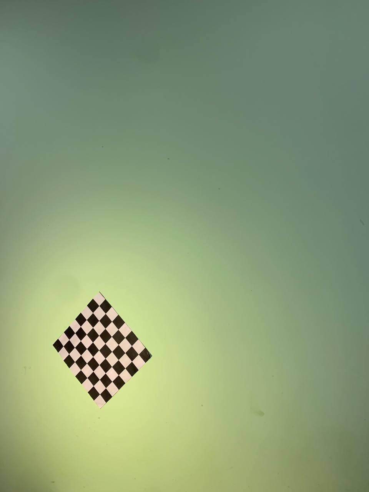

### Задание
Определить положение камеры смартфона в пространстве, используя библиотеку 	Aruco в координатах x,y,z.

### Для запуска
```python
virtualenv venv
source venv/bin/activate
pip install -r requirements.txt
python calibration.py
python task_2.py
```

### Путь к тестовой фотографии
Images/test_img/photo_2021-12-18_14-49-15.jpg

Координаты:
[[ 11.26759036]
 [-18.31118659]
 [-29.80362252]]


